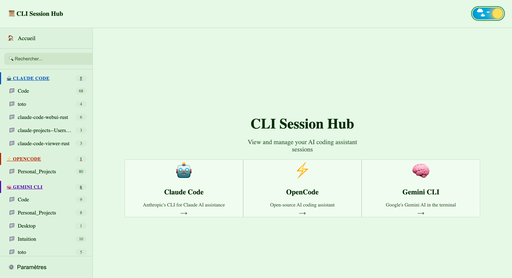
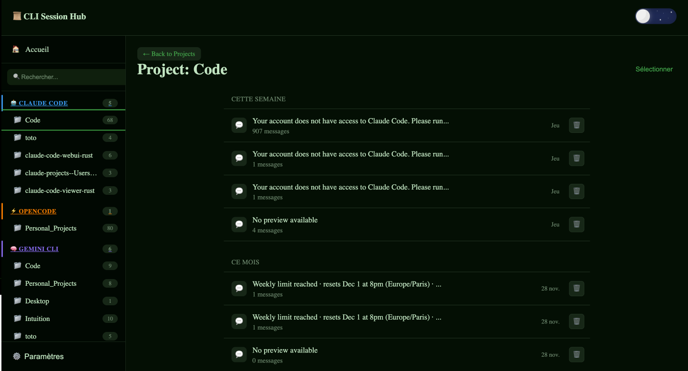
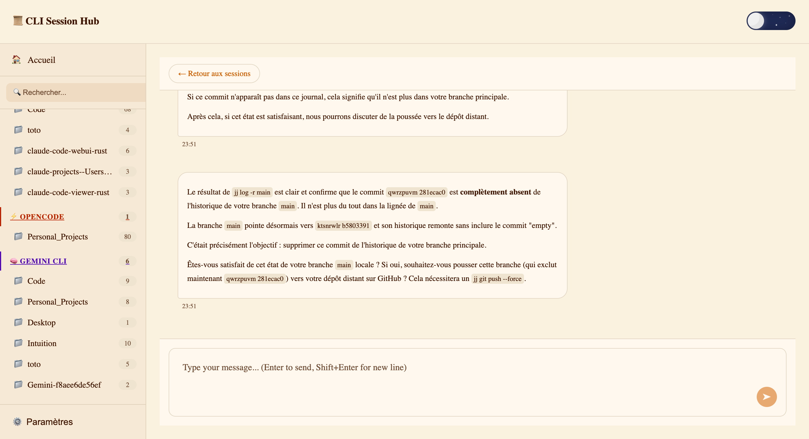
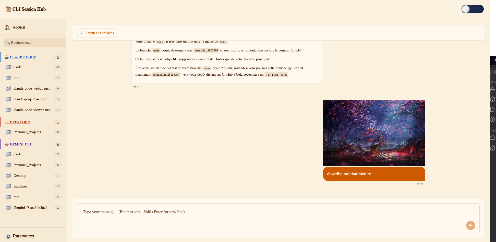
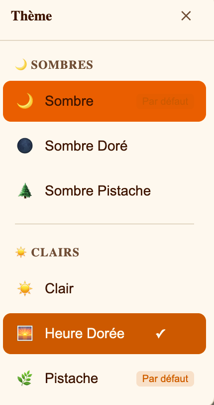

# CLI Session Hub Viewer

A Dioxus fullstack application for viewing, managing, and interacting with AI CLI session histories. Supports Claude, OpenCode, and Gemini CLI providers.

## Overview

This application provides a web interface to browse conversation histories created by AI command-line tools. It automatically discovers projects, parses session files (JSONL format), and allows real-time chat interactions with the underlying CLI.


*A general overview of the application interface.*

## Features

### Session Management

- Auto-discover Claude, OpenCode, and Gemini projects from filesystem
- List and search sessions with full-text search
- Group sessions by date (Today, Yesterday, This Week, This Month, Older)
- Archive and delete sessions
- View session metadata (duration, message count, timestamps)


*Browse and manage your AI CLI sessions.*

### Conversation Display

- Render full conversations with markdown support
- Display tool calls and results (Claude SDK format)
- Syntax highlighting for code blocks
- Breadcrumb navigation between projects, sessions, and conversations


### Live Chat

- Native chat interface using Claude CLI
- Streaming responses via NDJSON protocol
- Abort/cancel running requests
- Session continuity with conversation IDs
- Working directory selection for file operations


*Engage in real-time chat with your AI CLI.*

### Image Support

- Upload images via drag-and-drop or file picker
- Multiple image support with preview grid
- Base64 encoding for transmission
- Supported formats: JPEG, PNG, GIF, WebP


*Seamless image handling within conversations.*

### Multi-Provider Support

- Claude CLI (primary, full feature support)
- OpenCode CLI (image support via --file flag)
- Gemini CLI (text only, no headless image support)
- Provider detection and version checking
- Provider selector in UI

### Theme System

CLI Session Hub Viewer supports 6 beautiful themes that adapt to your preferences and workflow:


*A general overview of the available themes.*

#### Light Theme

*Clean and bright interface perfect for well-lit environments*

#### Dark Theme

*Easy on the eyes for extended coding sessions and low-light conditions*

#### Golden Theme

*Warm golden accents for a sophisticated, professional look*

#### Pistachio Theme

*Fresh green tones inspired by nature, great for focused work*

#### Dark Golden Theme

*Dark theme with golden highlights for elegant night-time coding*

#### Dark Pistachio Theme

*Dark interface with pistachio accents for a modern, calming experience*

**Features:**
- System theme detection (respects OS dark/light mode preferences)
- Theme persistence via localStorage (remembers your choice)
- Intelligent light/dark toggling (switches between appropriate variants)
- Accessible color schemes with proper contrast ratios

### Real-Time Sync

- Server-Sent Events (SSE) for CLI to web synchronization
- Auto-refresh on new CLI sessions
- Active process tracking

## Architecture

```
src/
├── app/                 # Dioxus UI layer (components, pages, layouts)
├── cli/                 # CLI executor abstraction (Claude, OpenCode, Gemini)
├── domain/              # Business logic and models (platform-agnostic)
├── handlers/            # Axum HTTP handlers (REST API)
├── history/             # Session discovery and JSONL parsing
├── infrastructure/      # Database adapters (SurrealDB, Redis)
├── server_fns/          # Dioxus server functions (RPC)
└── shared/              # Cross-platform utilities, hooks, errors
```

## Technology Stack

- **Framework**: Dioxus 0.7 (fullstack, WASM + SSR)
- **Backend**: Axum 0.8, Tokio
- **Database**: SurrealDB 2.1
- **Caching**: Redis (optional)
- **CSS**: Pure CSS with ITCSS/BEM methodology
- **Build**: LightningCSS for bundling

## Requirements

- Rust 2021 edition
- At least one CLI installed: `claude`, `opencode`, or `gemini`
- SurrealDB (for persistence)

## Usage

```bash
# Development
bash scripts/build-css.sh

dx serve --platform web

# Production build
dx build --release

# Run server
cargo run --bin server
```

## API Endpoints

| Endpoint | Method | Description |
|----------|--------|-------------|
| `/api/projects` | GET | List all discovered projects |
| `/api/projects/{name}/histories` | GET | List sessions for a project |
| `/api/projects/{name}/histories/{session_id}` | GET | Get conversation details |
| `/api/chat/native` | POST | Send message via native CLI |
| `/api/abort/{request_id}` | POST | Abort a running request |
| `/api/sse/{name}/{session_id}` | GET | SSE stream for real-time updates |

## Configuration

Environment variables:

| Variable | Description | Default |
|----------|-------------|---------|
| `RUST_LOG` | Log level (debug, info, warn, error) | info |
| `DATABASE_URL` | SurrealDB connection string | memory |
| `REDIS_URL` | Redis connection string (optional) | - |

## License

MIT
